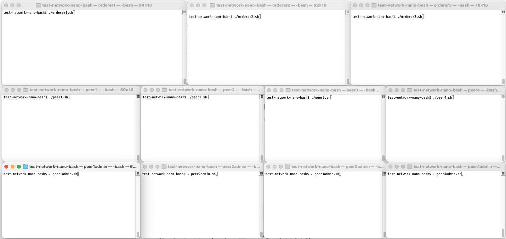

# MealChain - Network setup

This set of scripts are used to run the network required by the MealChain applications. 

# Prerequisites

- Hyperledger Fabric prerequisites [Available here](https://hyperledger-fabric.readthedocs.io/en/latest/prereqs.html)
- Hyperledger 2.X installed on the System. [Downloading the Fabric binaries](https://hyperledger-fabric.readthedocs.io/en/latest/install.html). 

Once the binaries are downloaded, make sure they're located at the bin folder of this repo. They won't be uploaded to the repository.

# Instructions for starting network

The first step to launch the network is to generate the required artifacts. 

I will run `./generate_artifacts.sh` to generate the required crypto material (Genesis block and configuration).

Open terminal windows for 3 ordering nodes, 4 peer nodes, and 4 peer admins as seen in the following terminal setup. The first two peers and peer admins belong to Org1, the latter two peer and peer admins belong to Org2.
Note, you can start with two ordering nodes and a single Org1 peer node and single Org1 peer admin terminal if you would like to keep things even more minimal (two ordering nodes are required to achieve consensus (2 of 3), while a single peer from Org1 can be utilized since the endorsement policy is set as any single organization).



The following instructions will have you run simple bash scripts that set environment variable overrides for a component and then runs the component.
The scripts contain only simple single-line commands so that they are easy to read and understand.
If you have trouble running bash scripts in your environment, you can just as easily copy and paste the individual commands from the script files instead of running the script files.


- In the three orderer terminals, run `./orderer1.sh`, `./orderer2.sh`, `./orderer3.sh` respectively
- In the four peer terminals, run `./peer1.sh`, `./peer2.sh`, `./peer3.sh`, `./peer4.sh` respectively
- Note that each orderer and peer write their data (including their ledgers) to their own subdirectory under the `data` directory
- In the four peer admin terminals, run `source peer1admin.sh`, `source peer2admin.sh`, `source peer3admin.sh`, `source peer4admin.sh` respectively

Note the syntax of running the scripts. The peer admin scripts run with the `source` command in order to source the script files in the respective shells. This is important so that the exported environment variables can be utilized by any subsequent user commands.

The `peer1admin.sh` script sets the peer1 admin environment variables, creates the application channel `mychannel`, updates the channel configuration for the org1 gossip anchor peer, and joins peer1 to `mychannel`.
The remaining peer admin scripts join their respective peers to `mychannel`.

# Instructions for deploying and running the basic asset transfer sample chaincode

To deploy and invoke the chaincode, utilize the peer1 admin terminal that you have created in the prior steps.

Package and install the chaincode on peer1:

```
peer lifecycle chaincode package basic.tar.gz --path ../asset-transfer-basic/chaincode-go --lang golang --label basic_1

peer lifecycle chaincode install basic.tar.gz
```

The chaincode install may take a minute since the `fabric-ccenv` chaincode builder docker image will be downloaded if not already available on your machine.
Copy the returned chaincode package ID into an environment variable for use in subsequent commands (your ID may be different):

```
export CC_PACKAGE_ID=basic_1:faaa38f2fc913c8344986a7d1617d21f6c97bc8d85ee0a489c90020cd57af4a5
```

Approve and commit the chaincode (only a single approver is required based on the lifecycle endorsement policy of any organization):

```
peer lifecycle chaincode approveformyorg -o 127.0.0.1:6050 --channelID mychannel --name basic --version 1 --package-id $CC_PACKAGE_ID --sequence 1 --tls --cafile ${PWD}/crypto-config/ordererOrganizations/example.com/orderers/orderer.example.com/tls/ca.crt

peer lifecycle chaincode commit -o 127.0.0.1:6050 --channelID mychannel --name basic --version 1 --sequence 1 --tls --cafile "${PWD}"/crypto-config/ordererOrganizations/example.com/orderers/orderer.example.com/tls/ca.crt
```

Invoke the chaincode to create an asset (only a single endorser is required based on the default endorsement policy of any organization).
Then query the asset, update it, and query again to see the resulting asset changes on the ledger.

```
peer chaincode invoke -o 127.0.0.1:6050 -C mychannel -n basic -c '{"Args":["CreateAsset","1","blue","35","tom","1000"]}' --tls --cafile "${PWD}"/crypto-config/ordererOrganizations/example.com/orderers/orderer.example.com/tls/ca.crt

peer chaincode query -C mychannel -n basic -c '{"Args":["ReadAsset","1"]}'

peer chaincode invoke -o 127.0.0.1:6050 -C mychannel -n basic -c '{"Args":["UpdateAsset","1","blue","35","jerry","1000"]}' --tls --cafile "${PWD}"/crypto-config/ordererOrganizations/example.com/orderers/orderer.example.com/tls/ca.crt

peer chaincode query -C mychannel -n basic -c '{"Args":["ReadAsset","1"]}'
```

Congratulations, you have deployed a minimal Fabric network! Inspect the scripts if you would like to see the minimal set of commands that were required to deploy the network.

Utilize `Ctrl-C` in the orderer and peer terminal windows to kill the orderer and peer processes. You can run the scripts again to restart the components with their existing data, or run `./generate_artifacts` again to clean up the existing artifacts and data if you would like to restart with a clean environment.
